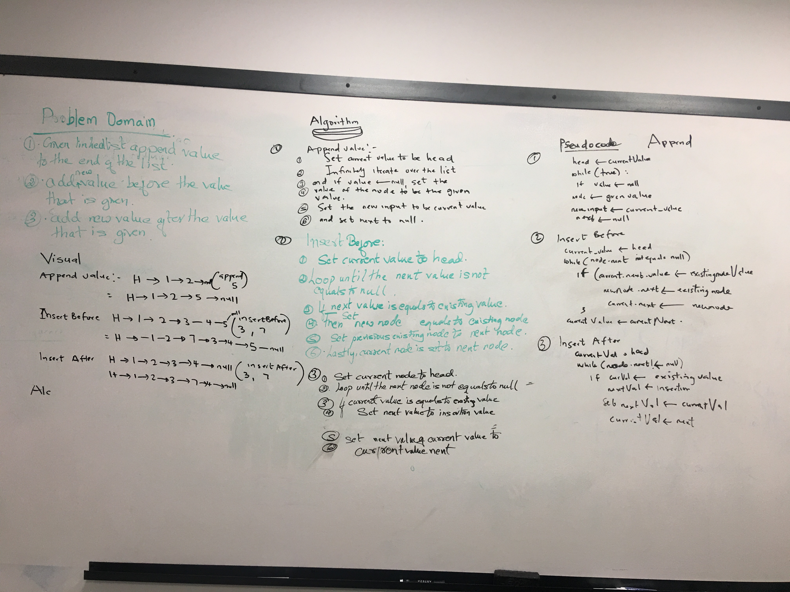

# AUTHOR: SILAS OYEWALE
## Table of contents
LinkedList Merge Implementation
### data-structures-and-algorithms

### Linked List Implementation
<!-- Short summary or background information -->
linked list is a popular data structure in java. It is a link of many nodes. Each node has a value and the memory location of the next node. The first node is called ther head and automatically has a memory location of null since its next node doesn't exist.

### Challenge
<!-- Description of the challenge -->
Write a method for the Linked List class which takes in 2 linked lists and merges them. Should return one non-empty list if one of the lists is empty.
### Approach & Efficiency
<!-- What approach did you take? Why? What is the Big O space/time for this approach? -->
 Merge them interchangeably until next is null and return the new list.  
## API
<!-- Description of each method publicly available to your Linked List -->
#### toString
Prints out the content of the list in the format . "{ a } -> { b } -> { c } -> NULL"
#### Append
Adds strings to the list.
#### insert
adds to the head or resets the head
#### includes
checks if a certain node value is in the list. RTeturns true if its in the list returns false if not in the list.
### Insert Before: 
Takes in 2 things. The current value in the node and the value to be inserted before the node
### Insert After
Takes 2 things. The current value in the node and the value to be inserted after the node.

# Image for whiteboard

