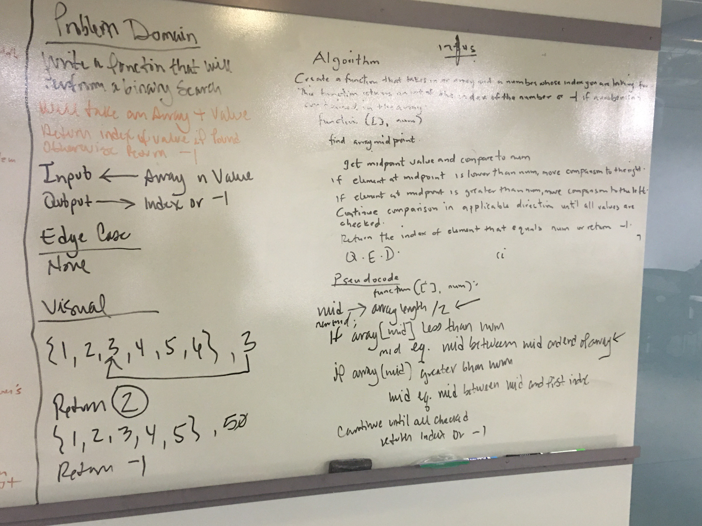

# AUTHOR: SILAS OYEWALE
## Table of contents
Binary Search
### data-structures-and-algorithms

### Reverse an Array
<!-- Short summary or background information -->
An array is a collection of similar data type 
Write a function that takes in an array and returns and array in a reversed order.

### Challenge
<!-- Description of the challenge -->
Write a function called reverseArray which takes an array as an argument. Without 
utilizing any of the built-in methods available to your language, return an array with elements in reversed order

### Approach & Efficiency
<!-- What approach did you take? Why? What is the Big O space/time for this approach? -->
The approach I took is to loop through the input array and reverse the indexes of the elements. 
Get the length of the array, declare an empty array, and loop over the input array. Declare a count to increase after each iteration and set the new array at position counter to be the postition i of the input array. Increment counter and return the new array. 
The big 0 is linear. Just one for loop.

# Image for whiteboard

